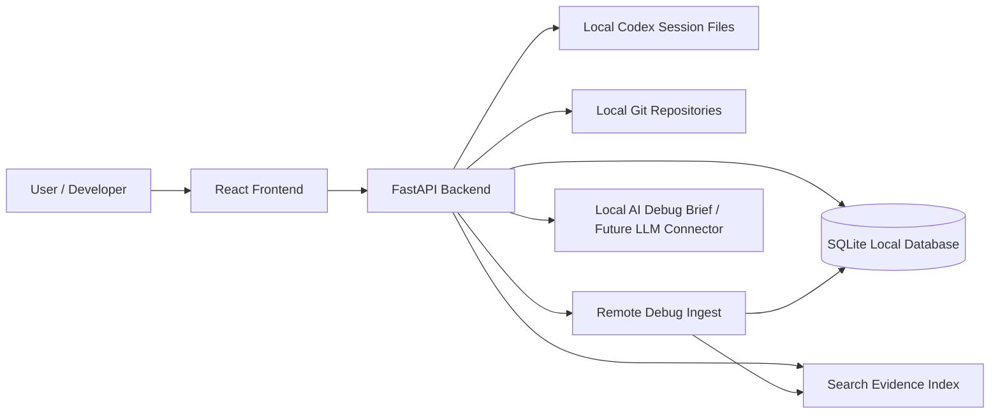
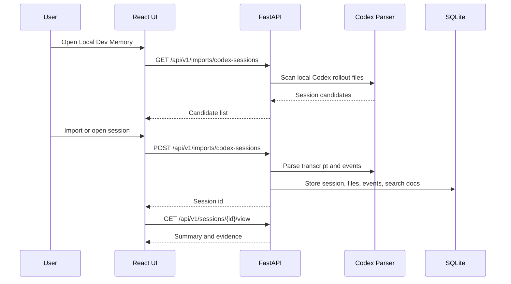
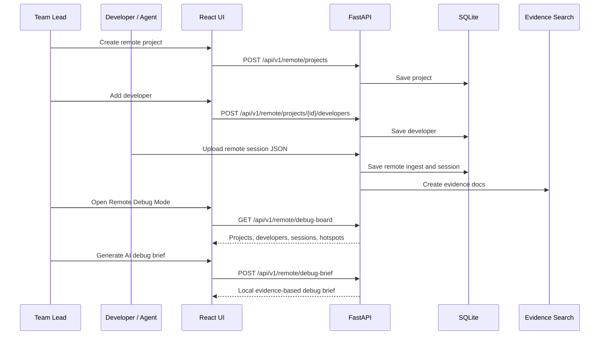
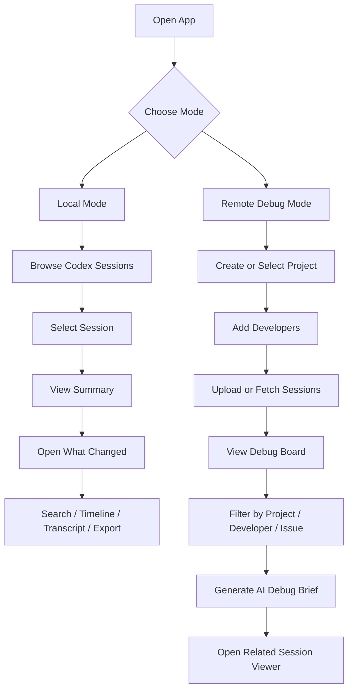
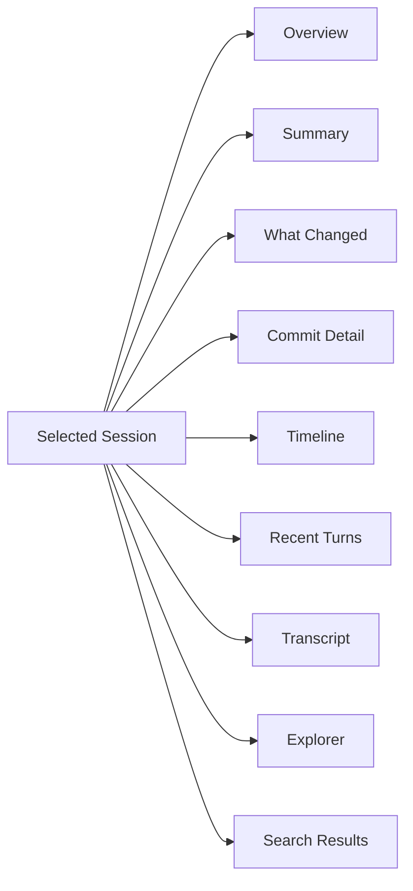
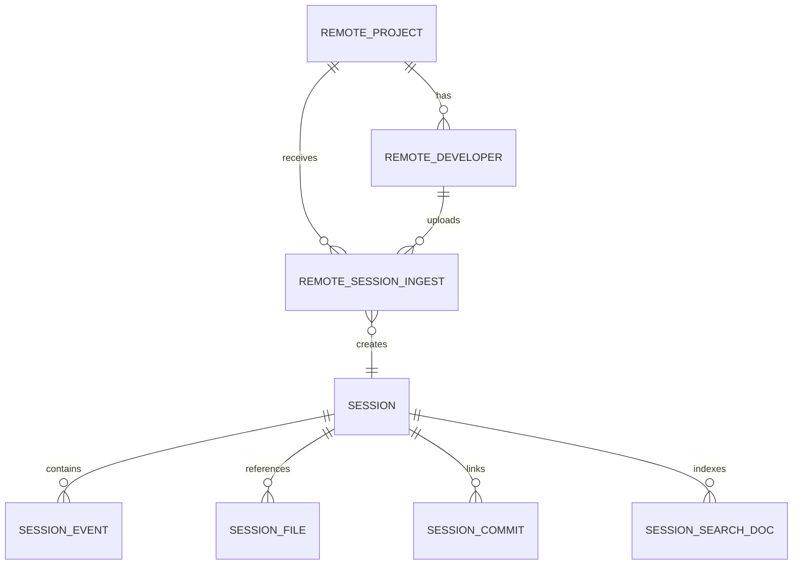
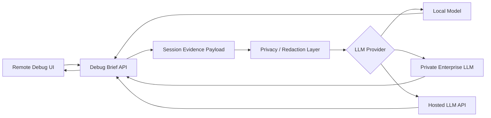
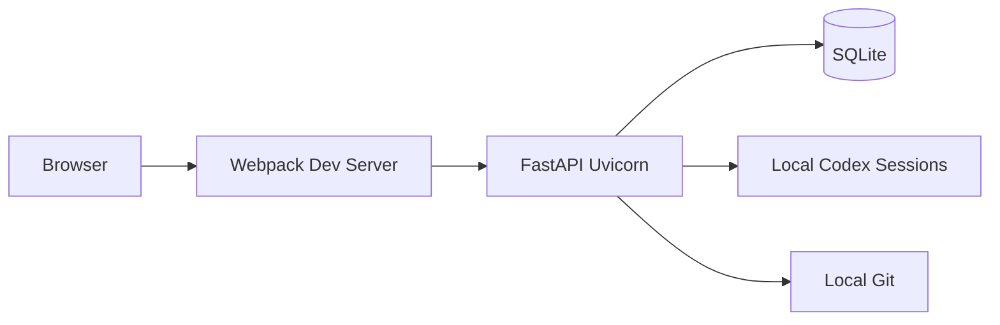
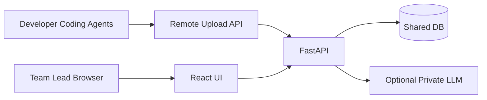

# Local Dev Memory - System Design and Architecture

## 1. Product Summary

Local Dev Memory is a private developer memory system that indexes coding-agent sessions and turns them into searchable engineering evidence.

It supports:

- Local developer session browsing.
- Codex session import.
- Search by file, repo, commit, decision, and text.
- Session evidence extraction.
- What Changed analysis.
- Remote Debug Mode for team sessions.
- Local AI-style debug briefs.
- Export to JSON and Markdown.

## 2. High-Level Architecture

## 3. Main Components

### Frontend

Technology:

- React
- Webpack
- CSS

Responsibilities:

- Local session browsing.
- Search UI.
- Session viewer tabs.
- Remote Debug Mode board.
- Demo mode.
- Upload forms.
- AI debug brief UI.
- Export links.

### Backend

Technology:

- FastAPI
- SQLAlchemy async
- SQLite

Responsibilities:

- Session APIs.
- Codex import APIs.
- Search APIs.
- Remote Debug APIs.
- Evidence extraction.
- Git commit inspection.
- Export generation.

### Database

Current database:

- SQLite local database

Main tables:

- `sessions`
- `session_events`
- `session_commits`
- `session_files`
- `session_search_docs`
- `agent_sources`
- `remote_projects`
- `remote_developers`
- `remote_session_ingests`

### Evidence Layer

The evidence layer extracts:

- user goal,
- session summary,
- decision snippets,
- file references,
- commit references,
- commands,
- tests,
- errors,
- outcomes,
- open questions,
- quality score,
- what changed data.

## 4. Local Mode Flow

## 5. Remote Debug Mode Flow

## 6. User Flow Diagram

## 7. Session Viewer Tabs

## 8. Remote Debug Board Data Model

## 9. API Surface

### Local Sessions

- `GET /api/v1/sessions`
- `GET /api/v1/sessions/{id}/view`
- `GET /api/v1/sessions/{id}/evidence`
- `GET /api/v1/sessions/{id}/timeline`
- `POST /api/v1/sessions/{id}/link-commit`
- `GET /api/v1/sessions/{id}/export.json`
- `GET /api/v1/sessions/{id}/export.md`

### Imports

- `GET /api/v1/imports/codex-sessions`
- `POST /api/v1/imports/codex-sessions`
- `POST /api/v1/imports/codex-sessions/reindex`

### Search

- `GET /api/v1/search?q=...`

### Remote Debug

- `GET /api/v1/remote/overview`
- `GET /api/v1/remote/debug-board`
- `POST /api/v1/remote/debug-brief`
- `POST /api/v1/remote/projects`
- `POST /api/v1/remote/projects/{project_id}/developers`
- `POST /api/v1/remote/sessions/upload`
- `POST /api/v1/remote/demo`
- `POST /api/v1/remote/fetch`

## 10. LLM Integration Design

Current mode:

- Local evidence-based debug brief.
- No private data needs to leave the machine.

Future LLM mode:

LLM should receive:

- scoped project,
- developer sessions,
- summaries,
- decisions,
- files,
- commands,
- tests,
- errors,
- issue counts,
- hotspot files,
- related commits.

LLM should return:

- likely root causes,
- risky files,
- related sessions,
- next debugging actions,
- confidence and evidence citations.

## 11. Security and Privacy

Current protections:

- local-first storage,
- secret redaction patterns,
- local SQLite index,
- no mandatory external LLM,
- source files are not deleted when index is cleared.

Recommended production upgrades:

- authentication,
- role-based access control,
- project-level permissions,
- audit logs,
- encrypted database or disk-level encryption,
- secure remote upload token,
- per-project retention policy,
- private LLM routing,
- PII and secret detection improvements.

## 12. Deployment Model

### Local Developer Mode

### Team / Remote Mode

## 13. Product Strengths

- Clear local developer value.
- Strong team debugging direction.
- Works with AI coding-agent sessions.
- Converts transcripts into structured evidence.
- Searchable by engineering context, not just code.
- Remote mode supports project and developer analysis.
- Local AI-style brief avoids immediate dependency on hosted LLMs.

## 14. Product Gaps

- Needs authentication before real team deployment.
- Needs automatic session uploader.
- Needs stronger GitHub/GitLab integration.
- Needs production database option.
- Needs background indexing for scale.
- Needs real LLM connector for advanced reasoning.
- Needs better enterprise admin controls.

## 15. Roadmap

1. Add authentication and project roles.
2. Add automatic developer session uploader.
3. Add GitHub/GitLab commit and PR integration.
4. Add private LLM connector.
5. Add issue tracker integration.
6. Add deployment scripts for team server mode.
7. Add audit logs and retention policies.
8. Add advanced analytics dashboard.

